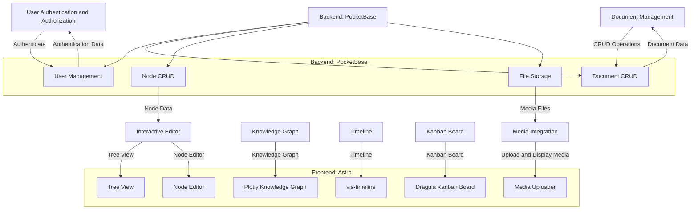

```mermaid
    graph TB
    A[User Authentication and Authorization]
    B[Document Management]
    C[Interactive Editor]
    D[Knowledge Graph]
    E[Timeline]
    F[Kanban Board]
    G[Media Integration]
    H[Backend: PocketBase]

    subgraph Frontend: Astro
        C1[Tree View]
        C2[Node Editor]
        D1[Plotly Knowledge Graph]
        E1[vis-timeline]
        F1[Dragula Kanban Board]
        G1[Media Uploader]
    end

    subgraph Backend: PocketBase
        A1[User Management]
        B1[Document CRUD]
        C3[Node CRUD]
        G2[File Storage]
    end

    H --> A1
    H --> B1
    H --> C3
    H --> G2

    A -->|Authenticate| A1
    B -->|CRUD Operations| B1
    C -->|Tree View| C1
    C -->|Node Editor| C2
    D -->|Knowledge Graph| D1
    E -->|Timeline| E1
    F -->|Kanban Board| F1
    G -->|Upload and Display Media| G1

    A1 -->|Authentication Data| A
    B1 -->|Document Data| B
    C3 -->|Node Data| C
    G2 -->|Media Files| G
```