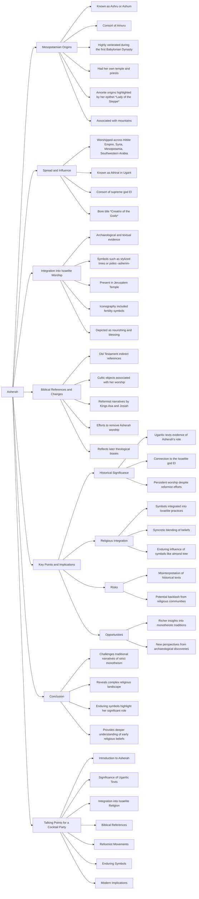

```mermaid
graph LR;
    A[Asherah] --> B[Mesopotamian Origins]
    B --> B1[Known as Ashru or Ashum]
    B --> B2[Consort of Amuru]
    B --> B3[Highly venerated during the first Babylonian Dynasty]
    B --> B4[Had her own temple and priests]
    B --> B5[Amorite origins highlighted by her epithet *Lady of the Steppe*]
    B --> B6[Associated with mountains]

    A --> C[Spread and Influence]
    C --> C1[Worshipped across Hittite Empire, Syria, Mesopotamia, Southwestern Arabia]
    C --> C2[Known as Athirat in Ugarit]
    C --> C3[Consort of supreme god El]
    C --> C4[Bore title *Creatrix of the Gods*]

    A --> D[Integration into Israelite Worship]
    D --> D1[Archaeological and textual evidence]
    D --> D2[Symbols such as stylized trees or poles -asherim-]
    D --> D3[Present in Jerusalem Temple]
    D --> D4[Iconography included fertility symbols]
    D --> D5[Depicted as nourishing and blessing]

    A --> E[Biblical References and Changes]
    E --> E1[Old Testament indirect references]
    E --> E2[Cultic objects associated with her worship]
    E --> E3[Reformist narratives by Kings Asa and Josiah]
    E --> E4[Efforts to remove Asherah worship]
    E --> E5[Reflects later theological biases]

    A --> F[Key Points and Implications]
    F --> F1[Historical Significance]
    F1 --> F1a[Ugaritic texts evidence of Asherah's role]
    F1 --> F1b[Connection to the Israelite god El]
    F1 --> F1c[Persistent worship despite reformist efforts]

    F --> F2[Religious Integration]
    F2 --> F2a[Symbols integrated into Israelite practices]
    F2 --> F2b[Syncretic blending of beliefs]
    F2 --> F2c[Enduring influence of symbols like almond tree]

    F --> F3[Risks]
    F3 --> F3a[Misinterpretation of historical texts]
    F3 --> F3b[Potential backlash from religious communities]

    F --> F4[Opportunities]
    F4 --> F4a[Richer insights into monotheistic traditions]
    F4 --> F4b[New perspectives from archaeological discoveries]

    A --> G[Conclusion]
    G --> G1[Challenges traditional narratives of strict monotheism]
    G --> G2[Reveals complex religious landscape]
    G --> G3[Enduring symbols highlight her significant role]
    G --> G4[Provides deeper understanding of early religious beliefs]

    A --> H[Talking Points for a Cocktail Party]
    H --> H1[Introduction to Asherah]
    H --> H2[Significance of Ugaritic Texts]
    H --> H3[Integration into Israelite Religion]
    H --> H4[Biblical References]
    H --> H5[Reformist Movements]
    H --> H6[Enduring Symbols]
    H --> H7[Modern Implications]
```