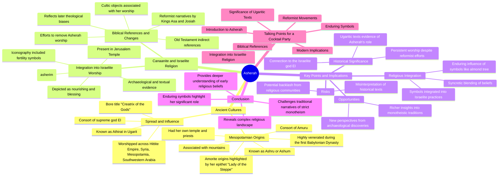

```mermaid
mindmap
  root((Asherah))
    Ancient Cultures
      Mesopotamian Origins
        Known as Ashru or Ashum
        Consort of Amuru
        Highly venerated during the first Babylonian Dynasty
        Had her own temple and priests
        Amorite origins highlighted by her epithet "Lady of the Steppe"
        Associated with mountains
      Spread and Influence
        Worshipped across Hittite Empire, Syria, Mesopotamia, Southwestern Arabia
        Known as Athirat in Ugarit
        Consort of supreme god El
        Bore title "Creatrix of the Gods"
    Canaanite and Israelite Religion
      Integration into Israelite Worship
        Archaeological and textual evidence
        Symbols such as stylized trees or poles (asherim)
        Present in Jerusalem Temple
        Iconography included fertility symbols
        Depicted as nourishing and blessing
      Biblical References and Changes
        Old Testament indirect references
        Cultic objects associated with her worship
        Reformist narratives by Kings Asa and Josiah
        Efforts to remove Asherah worship
        Reflects later theological biases
    Key Points and Implications
      Historical Significance
        Ugaritic texts evidence of Asherah's role
        Connection to the Israelite god El
        Persistent worship despite reformist efforts
      Religious Integration
        Symbols integrated into Israelite practices
        Syncretic blending of beliefs
        Enduring influence of symbols like almond tree
      Risks
        Misinterpretation of historical texts
        Potential backlash from religious communities
      Opportunities
        Richer insights into monotheistic traditions
        New perspectives from archaeological discoveries
    Conclusion
      Challenges traditional narratives of strict monotheism
      Reveals complex religious landscape
      Enduring symbols highlight her significant role
      Provides deeper understanding of early religious beliefs
    Talking Points for a Cocktail Party
      Introduction to Asherah
      Significance of Ugaritic Texts
      Integration into Israelite Religion
      Biblical References
      Reformist Movements
      Enduring Symbols
      Modern Implications
```