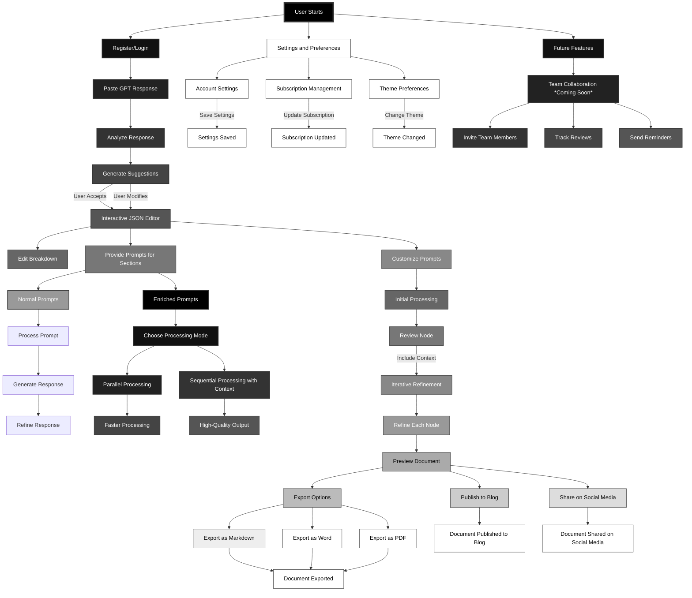

```mermaid
flowchart TD
    %% Main Flow
    A[User Starts] --> B[Register/Login]
    B --> C[Paste GPT Response]
    C --> D[Analyze Response]
    D --> E[Generate Suggestions]
    E --> |User Accepts| F[Interactive JSON Editor]
    E --> |User Modifies| F[Interactive JSON Editor]
    
    %% JSON Editor Interaction
    F --> G[Edit Breakdown]
    F --> H[Provide Prompts for Sections]
    F --> I[Customize Prompts]
    
    %% Normal Prompts
    H --> J[Normal Prompts]
    J --> K1[Process Prompt]
    K1 --> L1[Generate Response]
    L1 --> M1[Refine Response]
    
    %% Enriched Prompts Management
    H --> K[Enriched Prompts]
    K --> L[Choose Processing Mode]
    L --> M[Parallel Processing]
    L --> N[Sequential Processing with Context]
    
    M --> O[Faster Processing]
    N --> P[High-Quality Output]
    
    %% Iterative Refinement
    I --> Q[Initial Processing]
    Q --> R[Review Node]
    R --> |Include Context| S[Iterative Refinement]
    S --> T[Refine Each Node]

    %% Export and Publishing
    T --> U[Preview Document]
    U --> V[Export Options]
    U --> W[Publish to Blog]
    U --> X[Share on Social Media]
    
    %% Export Paths
    V --> Y1[Export as Markdown]
    V --> Y2[Export as Word]
    V --> Y3[Export as PDF]
    
    %% Settings and Preferences
    A --> Z[Settings and Preferences]
    Z --> AA[Account Settings]
    Z --> AB[Subscription Management]
    Z --> AC[Theme Preferences]

    %% Terminal Nodes
    AA --> |Save Settings| AD[Settings Saved]
    AB --> |Update Subscription| AE[Subscription Updated]
    AC --> |Change Theme| AF[Theme Changed]
    Y1 --> AG[Document Exported]
    Y2 --> AG[Document Exported]
    Y3 --> AG[Document Exported]
    W --> AH[Document Published to Blog]
    X --> AI[Document Shared on Social Media]

    %% Future Features
    A --> FA[Future Features]
    FA --> FB[Team Collaboration *Coming Soon*]
    FB --> FC[Invite Team Members]
    FB --> FD[Track Reviews]
    FB --> FE[Send Reminders]

    %% Styles
    style A fill:#000,stroke:#333,stroke-width:4px,color:#fff
    style B fill:#111,stroke:#333,stroke-width:2px,color:#fff
    style C fill:#222,stroke:#333,stroke-width:2px,color:#fff
    style D fill:#333,stroke:#333,stroke-width:2px,color:#fff
    style E fill:#444,stroke:#333,stroke-width:2px,color:#fff
    style F fill:#555,stroke:#333,stroke-width:2px,color:#fff
    style G fill:#666,stroke:#333,stroke-width:1px,color:#fff
    style H fill:#777,stroke:#333,stroke-width:1px,color:#fff
    style I fill:#888,stroke:#333,stroke-width:1px,color:#fff
    style J fill:#999,stroke:#333,stroke-width:2px,color:#fff
    style K fill:#000,stroke:#333,stroke-width:2px,color:#fff
    style L fill:#111,stroke:#333,stroke-width:2px,color:#fff
    style M fill:#222,stroke:#333,stroke-width:1px,color:#fff
    style N fill:#333,stroke:#333,stroke-width:1px,color:#fff
    style O fill:#444,stroke:#333,stroke-width:1px,color:#fff
    style P fill:#555,stroke:#333,stroke-width:1px,color:#fff
    style Q fill:#666,stroke:#333,stroke-width:1px,color:#fff
    style R fill:#777,stroke:#333,stroke-width:1px,color:#fff
    style S fill:#888,stroke:#333,stroke-width:1px,color:#fff
    style T fill:#999,stroke:#333,stroke-width:1px,color:#fff
    style U fill:#aaa,stroke:#333,stroke-width:1px,color:#000
    style V fill:#bbb,stroke:#333,stroke-width:1px,color:#000
    style W fill:#ccc,stroke:#333,stroke-width:1px,color:#000
    style X fill:#ddd,stroke:#333,stroke-width:1px,color:#000
    style Y1 fill:#eee,stroke:#333,stroke-width:1px,color:#000
    style Y2 fill:#fff,stroke:#333,stroke-width:1px,color:#000
    style Y3 fill:#fff,stroke:#333,stroke-width:1px,color:#000
    style Z fill:#fff,stroke:#333,stroke-width:1px,color:#000
    style AA fill:#fff,stroke:#333,stroke-width:1px,color:#000
    style AB fill:#fff,stroke:#333,stroke-width:1px,color:#000
    style AC fill:#fff,stroke:#333,stroke-width:1px,color:#000
    style AD fill:#fff,stroke:#333,stroke-width:1px,color:#000
    style AE fill:#fff,stroke:#333,stroke-width:1px,color:#000
    style AF fill:#fff,stroke:#333,stroke-width:1px,color:#000
    style AG fill:#fff,stroke:#333,stroke-width:1px,color:#000
    style AH fill:#fff,stroke:#333,stroke-width:1px,color:#000
    style AI fill:#fff,stroke:#333,stroke-width:1px,color:#000
    style FA fill:#111,stroke:#333,stroke-width:2px,color:#fff
    style FB fill:#222,stroke:#333,stroke-width:2px,color:#fff
    style FC fill:#333,stroke:#333,stroke-width:2px,color:#fff
    style FD fill:#444,stroke:#333,stroke-width:2px,color:#fff
    style FE fill:#555,stroke:#333,stroke-width:2px,color:#fff
```