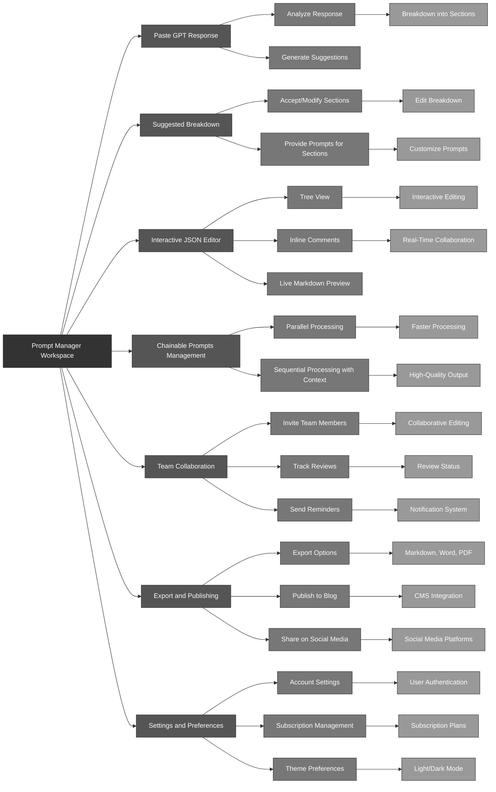

```mermaid
graph LR
    A[Prompt Manager Workspace] --> B1[Paste GPT Response]
    A --> B2[Suggested Breakdown]
    A --> B3[Interactive JSON Editor]
    A --> B4[Chainable Prompts Management]
    A --> B5[Team Collaboration]
    A --> B6[Export and Publishing]
    A --> B7[Settings and Preferences]

    B1 --> C1[Analyze Response]
    B1 --> C2[Generate Suggestions]
    C1 --> D1[Breakdown into Sections]

    B2 --> C3[Accept/Modify Sections]
    B2 --> C4[Provide Prompts for Sections]
    C3 --> D2[Edit Breakdown]
    C4 --> D3[Customize Prompts]

    B3 --> C5[Tree View]
    B3 --> C6[Inline Comments]
    B3 --> C7[Live Markdown Preview]
    C5 --> D4[Interactive Editing]
    C6 --> D5[Real-Time Collaboration]

    B4 --> C8[Parallel Processing]
    B4 --> C9[Sequential Processing with Context]
    C8 --> D6[Faster Processing]
    C9 --> D7[High-Quality Output]

    B5 --> C10[Invite Team Members]
    B5 --> C11[Track Reviews]
    B5 --> C12[Send Reminders]
    C10 --> D8[Collaborative Editing]
    C11 --> D9[Review Status]
    C12 --> D10[Notification System]

    B6 --> C13[Export Options]
    B6 --> C14[Publish to Blog]
    B6 --> C15[Share on Social Media]
    C13 --> D11[Markdown, Word, PDF]
    C14 --> D12[CMS Integration]
    C15 --> D13[Social Media Platforms]

    B7 --> C16[Account Settings]
    B7 --> C17[Subscription Management]
    B7 --> C18[Theme Preferences]
    C16 --> D14[User Authentication]
    C17 --> D15[Subscription Plans]
    C18 --> D16[Light/Dark Mode]

    style A fill:#333,stroke:#333,stroke-width:2px,color:#fff
    style B1 fill:#555,stroke:#333,stroke-width:1px,color:#fff
    style B2 fill:#555,stroke:#333,stroke-width:1px,color:#fff
    style B3 fill:#555,stroke:#333,stroke-width:1px,color:#fff
    style B4 fill:#555,stroke:#333,stroke-width:1px,color:#fff
    style B5 fill:#555,stroke:#333,stroke-width:1px,color:#fff
    style B6 fill:#555,stroke:#333,stroke-width:1px,color:#fff
    style B7 fill:#555,stroke:#333,stroke-width:1px,color:#fff
    style C1 fill:#777,stroke:#333,stroke-width:1px,color:#fff
    style C2 fill:#777,stroke:#333,stroke-width:1px,color:#fff
    style C3 fill:#777,stroke:#333,stroke-width:1px,color:#fff
    style C4 fill:#777,stroke:#333,stroke-width:1px,color:#fff
    style C5 fill:#777,stroke:#333,stroke-width:1px,color:#fff
    style C6 fill:#777,stroke:#333,stroke-width:1px,color:#fff
    style C7 fill:#777,stroke:#333,stroke-width:1px,color:#fff
    style C8 fill:#777,stroke:#333,stroke-width:1px,color:#fff
    style C9 fill:#777,stroke:#333,stroke-width:1px,color:#fff
    style C10 fill:#777,stroke:#333,stroke-width:1px,color:#fff
    style C11 fill:#777,stroke:#333,stroke-width:1px,color:#fff
    style C12 fill:#777,stroke:#333,stroke-width:1px,color:#fff
    style C13 fill:#777,stroke:#333,stroke-width:1px,color:#fff
    style C14 fill:#777,stroke:#333,stroke-width:1px,color:#fff
    style C15 fill:#777,stroke:#333,stroke-width:1px,color:#fff
    style C16 fill:#777,stroke:#333,stroke-width:1px,color:#fff
    style C17 fill:#777,stroke:#333,stroke-width:1px,color:#fff
    style C18 fill:#777,stroke:#333,stroke-width:1px,color:#fff
    style D1 fill:#999,stroke:#333,stroke-width:1px,color:#fff
    style D2 fill:#999,stroke:#333,stroke-width:1px,color:#fff
    style D3 fill:#999,stroke:#333,stroke-width:1px,color:#fff
    style D4 fill:#999,stroke:#333,stroke-width:1px,color:#fff
    style D5 fill:#999,stroke:#333,stroke-width:1px,color:#fff
    style D6 fill:#999,stroke:#333,stroke-width:1px,color:#fff
    style D7 fill:#999,stroke:#333,stroke-width:1px,color:#fff
    style D8 fill:#999,stroke:#333,stroke-width:1px,color:#fff
    style D9 fill:#999,stroke:#333,stroke-width:1px,color:#fff
    style D10 fill:#999,stroke:#333,stroke-width:1px,color:#fff
    style D11 fill:#999,stroke:#333,stroke-width:1px,color:#fff
    style D12 fill:#999,stroke:#333,stroke-width:1px,color:#fff
    style D13 fill:#999,stroke:#333,stroke-width:1px,color:#fff
    style D14 fill:#999,stroke:#333,stroke-width:1px,color:#fff
    style D15 fill:#999,stroke:#333,stroke-width:1px,color:#fff
    style D16 fill:#999,stroke:#333,stroke-width:1px,color:#fff

```