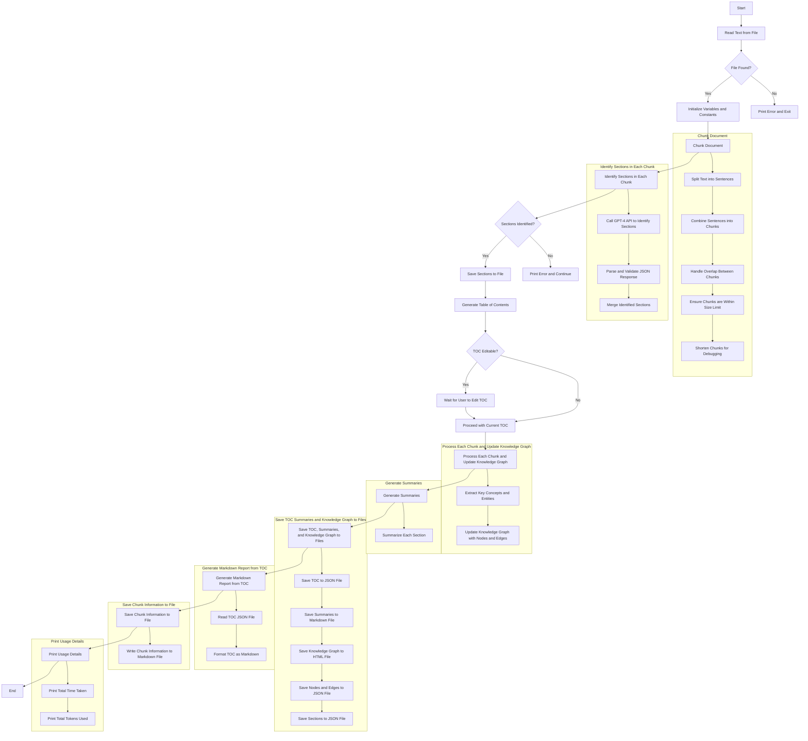

```mermaid
flowchart TD
    A[Start] --> B[Read Text from File]
    B --> C{File Found?}
    C -- Yes --> D[Initialize Variables and Constants]
    C -- No --> E[Print Error and Exit]
    D --> F[Chunk Document]
    F --> G[Identify Sections in Each Chunk]
    G --> H{Sections Identified?}
    H -- Yes --> I[Save Sections to File]
    H -- No --> J[Print Error and Continue]
    I --> K[Generate Table of Contents]
    K --> L{TOC Editable?}
    L -- Yes --> M[Wait for User to Edit TOC]
    L -- No --> N[Proceed with Current TOC]
    M --> N
    N --> O[Process Each Chunk and Update Knowledge Graph]
    O --> P[Generate Summaries]
    P --> Q[Save TOC, Summaries, and Knowledge Graph to Files]
    Q --> R[Generate Markdown Report from TOC]
    R --> S[Save Chunk Information to File]
    S --> T[Print Usage Details]
    T --> U[End]

    subgraph Chunk Document
        F1[Split Text into Sentences]
        F2[Combine Sentences into Chunks]
        F3[Handle Overlap Between Chunks]
        F4[Ensure Chunks are Within Size Limit]
        F5[Shorten Chunks for Debugging]
        F --> F1 --> F2 --> F3 --> F4 --> F5
    end

    subgraph Identify Sections in Each Chunk
        G1[Call GPT-4 API to Identify Sections]
        G2[Parse and Validate JSON Response]
        G3[Merge Identified Sections]
        G --> G1 --> G2 --> G3
    end

    subgraph Process Each Chunk and Update Knowledge Graph
        O1[Extract Key Concepts and Entities]
        O2[Update Knowledge Graph with Nodes and Edges]
        O --> O1 --> O2
    end

    subgraph Generate Summaries
        P1[Summarize Each Section]
        P --> P1
    end

    subgraph Save TOC Summaries and Knowledge Graph to Files
        Q1[Save TOC to JSON File]
        Q2[Save Summaries to Markdown File]
        Q3[Save Knowledge Graph to HTML File]
        Q4[Save Nodes and Edges to JSON File]
        Q5[Save Sections to JSON File]
        Q --> Q1 --> Q2 --> Q3 --> Q4 --> Q5
    end

    subgraph Generate Markdown Report from TOC
        R1[Read TOC JSON File]
        R2[Format TOC as Markdown]
        R --> R1 --> R2
    end

    subgraph Save Chunk Information to File
        S1[Write Chunk Information to Markdown File]
        S --> S1
    end

    subgraph Print Usage Details
        T1[Print Total Time Taken]
        T2[Print Total Tokens Used]
        T --> T1 --> T2
    end

```