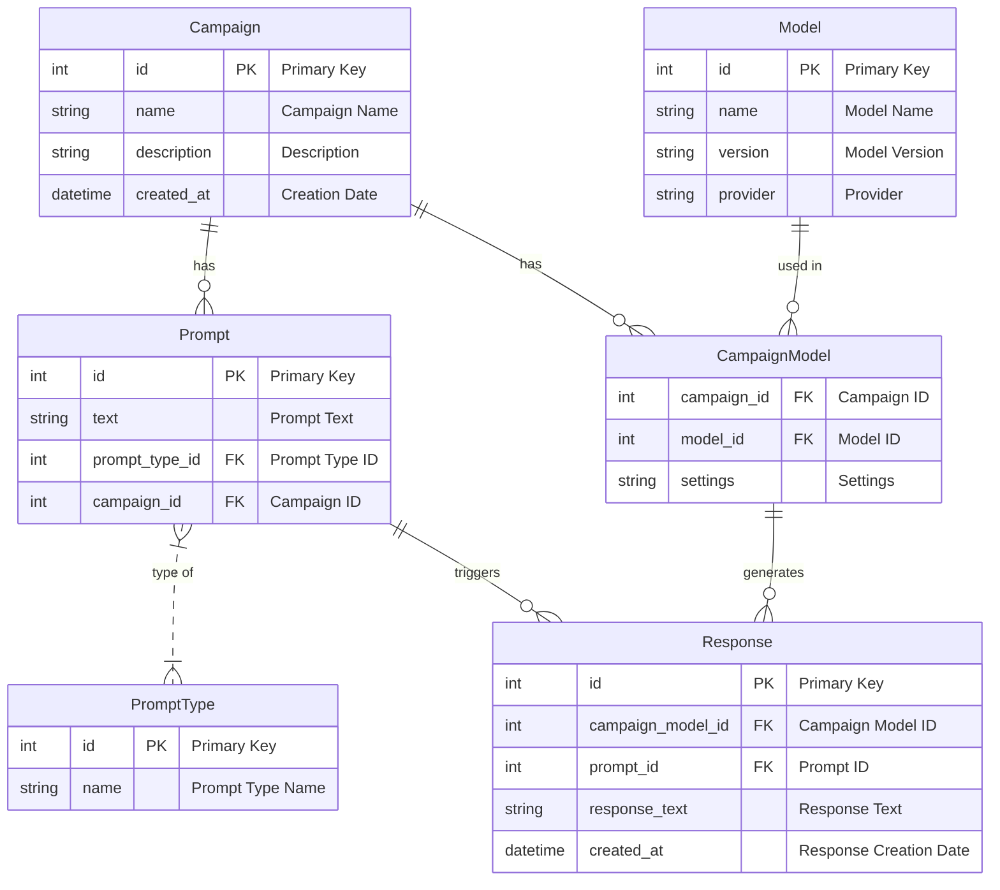

```mermaid
erDiagram

Campaign {
    int id PK "Primary Key"
    string name "Campaign Name"
    string description "Description"
    datetime created_at "Creation Date"
}

Prompt {
    int id PK "Primary Key"
    string text "Prompt Text"
    int prompt_type_id FK "Prompt Type ID"
    int campaign_id FK "Campaign ID"
}

PromptType {
    int id PK "Primary Key"
    string name "Prompt Type Name"
}

Model {
    int id PK "Primary Key"
    string name "Model Name"
    string version "Model Version"
    string provider "Provider"
}

CampaignModel {
    int campaign_id FK "Campaign ID"
    int model_id FK "Model ID"
    string settings "Settings"
}

Response {
    int id PK "Primary Key"
    int campaign_model_id FK "Campaign Model ID"
    int prompt_id FK "Prompt ID"
    string response_text "Response Text"
    datetime created_at "Response Creation Date"
}

Campaign ||--o{ Prompt : "has"
Campaign ||--o{ CampaignModel : "has"
Prompt }|..|{ PromptType : "type of"
Model ||--o{ CampaignModel : "used in"
CampaignModel ||--o{ Response : "generates"
Prompt ||--o{ Response : "triggers"

```