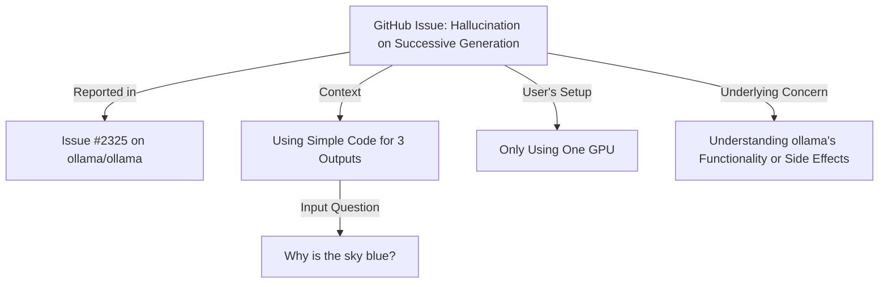

```mermaid
graph TD;
    A[GitHub Issue: Hallucination on Successive Generation] -->|Reported in| B[Issue #2325 on ollama/ollama];
    A -->|Context| C[Using Simple Code for 3 Outputs];
    C -->|Input Question| D["Why is the sky blue?"];
    A -->|User's Setup| E[Only Using One GPU];
    A -->|Underlying Concern| F[Understanding ollama's Functionality or Side Effects];

```