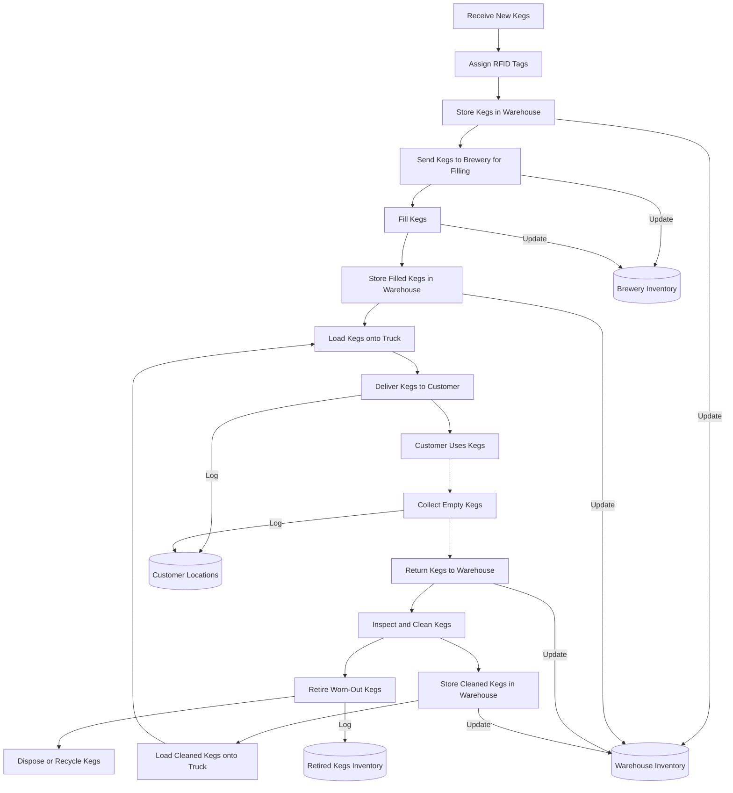

```mermaid
flowchart TD
    %% Tasks
    A[Receive New Kegs] --> B[Assign RFID Tags]
    B --> C[Store Kegs in Warehouse]
    C --> D[Send Kegs to Brewery for Filling]
    D --> E[Fill Kegs]
    E --> F[Store Filled Kegs in Warehouse]
    F --> G[Load Kegs onto Truck]
    G --> H[Deliver Kegs to Customer]
    H --> I[Customer Uses Kegs]
    I --> J[Collect Empty Kegs]
    J --> K[Return Kegs to Warehouse]
    K --> L[Inspect and Clean Kegs]
    L --> M[Store Cleaned Kegs in Warehouse]
    M --> N[Load Cleaned Kegs onto Truck]
    N --> G
    L --> O[Retire Worn-Out Kegs]
    O --> P[Dispose or Recycle Kegs]

    %% Data Stores
    DB1[(Warehouse Inventory)]
    DB2[(Brewery Inventory)]
    DB3[(Customer Locations)]
    DB4[(Retired Kegs Inventory)]

    %% Data Flow
    C -->|Update| DB1
    F -->|Update| DB1
    K -->|Update| DB1
    M -->|Update| DB1
    D -->|Update| DB2
    E -->|Update| DB2
    H -->|Log| DB3
    J -->|Log| DB3
    O -->|Log| DB4

```