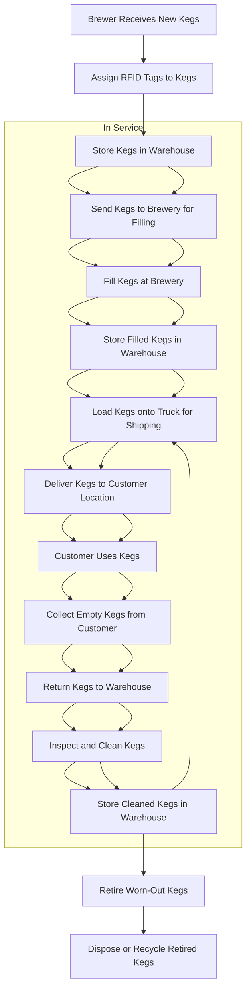

```mermaid
graph TD
    A[Brewer Receives New Kegs] --> B[Assign RFID Tags to Kegs]
    B --> C[Store Kegs in Warehouse]
    C --> D[Send Kegs to Brewery for Filling]
    D --> E[Fill Kegs at Brewery]
    E --> F[Store Filled Kegs in Warehouse]
    F --> G[Load Kegs onto Truck for Shipping]
    G --> H[Deliver Kegs to Customer Location]
    H --> I[Customer Uses Kegs]
    I --> J[Collect Empty Kegs from Customer]
    J --> K[Return Kegs to Warehouse]
    K --> L[Inspect and Clean Kegs]
    L --> M[Store Cleaned Kegs in Warehouse]
    M --> N[Retire Worn-Out Kegs]
    N --> O[Dispose or Recycle Retired Kegs]

    subgraph "In Service"
        C --> D
        D --> E
        E --> F
        F --> G
        G --> H
        H --> I
        I --> J
        J --> K
        K --> L
        L --> M
        M --> G
    end

```