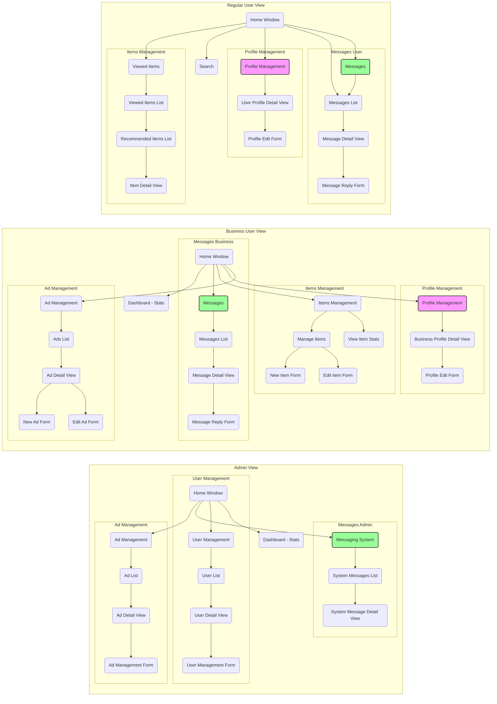

```mermaid
graph LR

%% Admin View
subgraph Admin View
    A1(Home Window)
    A1 --> A1A(Dashboard - Stats)
    
    subgraph User Management
        A1 --> A2(User Management)
        A2 --> A6(User List)
        A6 --> A7(User Detail View)
        A7 --> A8(User Management Form)
    end
    
    subgraph Messages Admin
        A1 --> A3(Messaging System)
        A3 --> A13(System Messages List)
        A13 --> A14(System Message Detail View)
    end
    
    subgraph Ad Management
        A1 --> A4(Ad Management)
        A4 --> A10(Ad List)
        A10 --> A11(Ad Detail View)
        A11 --> A12(Ad Management Form)
    end
end

%% Business User View
subgraph Business User View
    B1(Home Window)
    B1 --> B1A(Dashboard - Stats)
    
    subgraph Messages Business
        B1 --> B2(Messages)
        B2 --> B6(Messages List)
        B6 --> B7(Message Detail View)
        B7 --> B8(Message Reply Form)
    end
    
    subgraph Items Management
        B1 --> B3(Items Management)
        B3 --> B9(Manage Items)
        B9 --> B10(New Item Form)
        B9 --> B12(Edit Item Form)
        B3 --> B11(View Item Stats)
    end
    
    subgraph Profile Management
        B1 --> B5(Profile Management)
        B5 --> B17(Business Profile Detail View)
        B17 --> B18(Profile Edit Form)
    end
    
    subgraph Ad Management
        B1 --> B4(Ad Management)
        B4 --> B13(Ads List)
        B13 --> B14(Ad Detail View)
        B14 --> B15(New Ad Form)
        B14 --> B16(Edit Ad Form)
    end
end

%% Regular User View
subgraph Regular User View
    C1(Home Window)
    C1 --> C1A(Search)
    C1 --> C2(Messages)
    C1 --> C4(Viewed Items)
    C1 --> C5(Saved Items)
    C1 --> C3(Profile Management)
    
    subgraph Messages User
        C2 --> C5(Messages List)
        C5 --> C6(Message Detail View)
        C6 --> C7(Message Reply Form)
    end
    
    subgraph Profile Management
        C3 --> C8(User Profile Detail View)
        C8 --> C9(Profile Edit Form)
    end
    
    subgraph Items Management
        C4 --> C10(Viewed Items List)
        C10 --> C11(Recommended Items List)
        C11 --> C12(Item Detail View)
    end
end

%% Highlighting Duplicate Functions
style B5 fill:#f9f,stroke:#333,stroke-width:2px
style C3 fill:#f9f,stroke:#333,stroke-width:2px
style A3 fill:#9f9,stroke:#333,stroke-width:2px
style B2 fill:#9f9,stroke:#333,stroke-width:2px
style C2 fill:#9f9,stroke:#333,stroke-width:2px

```