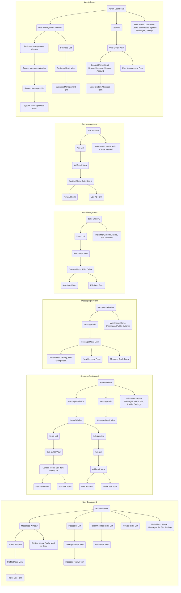

```mermaid
graph LR
    subgraph User Dashboard
        A1(Home Window) --> A2(Messages Window)
        A2 --> A3(Profile Window)
        A1 --> A4(Messages List)
        A1 --> A5(Recommended Items List)
        A1 --> A6(Viewed Items List)
        A4 --> A7(Message Detail View)
        A5 --> A8(Item Detail View)
        A3 --> A9(Profile Detail View)
        A1 --> A10(Main Menu: Home, Messages, Profile, Settings)
        A2 --> A11(Context Menu: Reply, Mark as Read)
        A9 --> A12(Profile Edit Form)
        A7 --> A13(Message Reply Form)
    end

    subgraph Business Dashboard
        B1(Home Window) --> B2(Messages Window)
        B2 --> B3(Items Window)
        B3 --> B4(Ads Window)
        B1 --> B5(Messages List)
        B3 --> B6(Items List)
        B4 --> B7(Ads List)
        B5 --> B8(Message Detail View)
        B6 --> B9(Item Detail View)
        B7 --> B10(Ad Detail View)
        B1 --> B11(Main Menu: Home, Messages, Items, Ads, Profile, Settings)
        B9 --> B12(Context Menu: Edit Item, Delete Ad)
        B12 --> B13(New Item Form)
        B12 --> B14(Edit Item Form)
        B10 --> B15(New Ad Form)
        B10 --> B16(Profile Edit Form)
    end

    subgraph Messaging System
        C1(Messages Window) --> C2(Messages List)
        C2 --> C3(Message Detail View)
        C1 --> C4(Main Menu: Home, Messages, Profile, Settings)
        C3 --> C5(Context Menu: Reply, Mark as Important)
        C3 --> C6(New Message Form)
        C3 --> C7(Message Reply Form)
    end

    subgraph Item Management
        D1(Items Window) --> D2(Items List)
        D2 --> D3(Item Detail View)
        D1 --> D4(Main Menu: Home, Items, Add New Item)
        D3 --> D5(Context Menu: Edit, Delete)
        D5 --> D6(New Item Form)
        D5 --> D7(Edit Item Form)
    end

    subgraph Ads Management
        E1(Ads Window) --> E2(Ads List)
        E2 --> E3(Ad Detail View)
        E1 --> E4(Main Menu: Home, Ads, Create New Ad)
        E3 --> E5(Context Menu: Edit, Delete)
        E5 --> E6(New Ad Form)
        E5 --> E7(Edit Ad Form)
    end

    subgraph Admin Panel
        F1(Admin Dashboard) --> F2(User Management Window)
        F2 --> F3(Business Management Window)
        F3 --> F4(System Messages Window)
        F1 --> F5(User List)
        F2 --> F6(Business List)
        F4 --> F7(System Messages List)
        F5 --> F8(User Detail View)
        F6 --> F9(Business Detail View)
        F7 --> F10(System Message Detail View)
        F1 --> F11(Main Menu: Dashboard, Users, Businesses, System Messages, Settings)
        F8 --> F12(Context Menu: Send System Message, Manage Account)
        F12 --> F13(Send System Message Form)
        F8 --> F14(User Management Form)
        F9 --> F15(Business Management Form)
    end

```