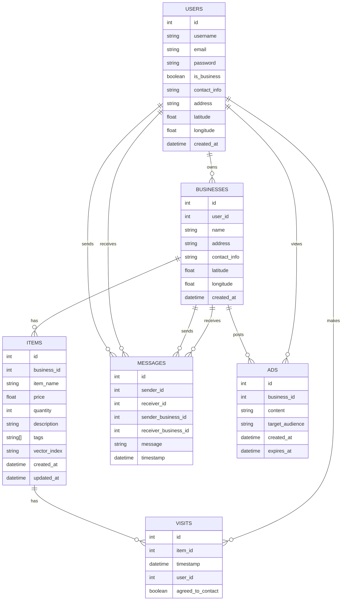

```mermaid
erDiagram
    USERS {
        int id
        string username
        string email
        string password
        boolean is_business
        string contact_info
        string address
        float latitude
        float longitude
        datetime created_at
    }

    BUSINESSES {
        int id
        int user_id
        string name
        string address
        string contact_info
        float latitude
        float longitude
        datetime created_at
    }

    ITEMS {
        int id
        int business_id
        string item_name
        float price
        int quantity
        string description
        string[] tags
        string vector_index
        datetime created_at
        datetime updated_at
    }

    VISITS {
        int id
        int item_id
        datetime timestamp
        int user_id
        boolean agreed_to_contact
    }

    MESSAGES {
        int id
        int sender_id
        int receiver_id
        int sender_business_id
        int receiver_business_id
        string message
        datetime timestamp
    }

    ADS {
        int id
        int business_id
        string content
        string target_audience
        datetime created_at
        datetime expires_at
    }

    USERS ||--o{ BUSINESSES: owns
    BUSINESSES ||--o{ ITEMS: has
    ITEMS ||--o{ VISITS: has
    USERS ||--o{ VISITS: makes
    USERS ||--o{ MESSAGES: sends
    USERS ||--o{ MESSAGES: receives
    BUSINESSES ||--o{ MESSAGES: sends
    BUSINESSES ||--o{ MESSAGES: receives
    BUSINESSES ||--o{ ADS: posts
    USERS ||--o{ ADS: views

```