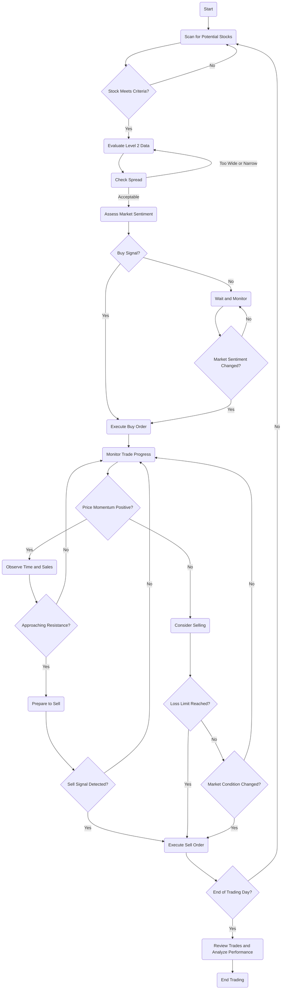

```mermaid
flowchart TD
    A(Start) --> B(Scan for Potential Stocks)
    B --> C{Stock Meets Criteria?}
    C -->|Yes| D(Evaluate Level 2 Data)
    C -->|No| B

    D --> E(Check Spread)
    E -->|Acceptable| F(Assess Market Sentiment)
    E -->|Too Wide or Narrow| D

    F --> G{Buy Signal?}
    G -->|Yes| H(Execute Buy Order)
    G -->|No| I(Wait and Monitor)

    H --> J(Monitor Trade Progress)
    J --> K{Price Momentum Positive?}
    K -->|Yes| L(Observe Time and Sales)
    K -->|No| M(Consider Selling)

    L --> N{Approaching Resistance?}
    N -->|Yes| O(Prepare to Sell)
    N -->|No| J

    O --> P{Sell Signal Detected?}
    P -->|Yes| Q(Execute Sell Order)
    P -->|No| J

    M --> R{Loss Limit Reached?}
    R -->|Yes| Q
    R -->|No| S{Market Condition Changed?}
    S -->|Yes| Q
    S -->|No| J

    I --> T{Market Sentiment Changed?}
    T -->|Yes| H
    T -->|No| I

    Q --> U{End of Trading Day?}
    U -->|Yes| V(Review Trades and Analyze Performance)
    U -->|No| B

    V --> W(End Trading)

```