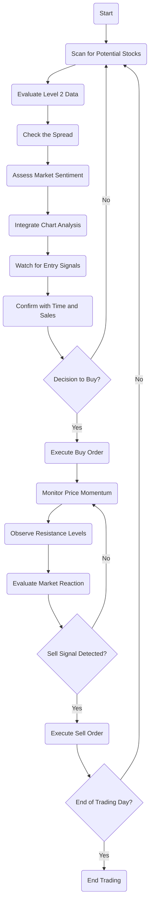

```mermaid
flowchart TD
    A(Start) --> B(Scan for Potential Stocks)
    B --> C(Evaluate Level 2 Data)
    C --> D(Check the Spread)
    D --> E(Assess Market Sentiment)
    E --> F(Integrate Chart Analysis)
    F --> G(Watch for Entry Signals)
    G --> H(Confirm with Time and Sales)
    H --> I{Decision to Buy?}
    I -->|Yes| J(Execute Buy Order)
    I -->|No| B

    J --> K(Monitor Price Momentum)
    K --> L(Observe Resistance Levels)
    L --> M(Evaluate Market Reaction)
    M --> N{Sell Signal Detected?}
    N -->|Yes| O(Execute Sell Order)
    N -->|No| K

    O --> P{End of Trading Day?}
    P -->|Yes| Q(End Trading)
    P -->|No| B

```