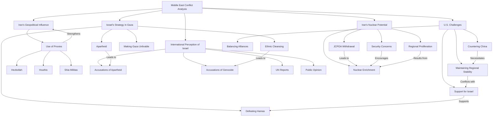

```mermaid
graph TD
    A[Middle East Conflict Analysis]

    A1["Israel's Strategy in Gaza"]
    A2["U.S. Challenges"]
    A3["Iran's Geopolitical Influence"]
    A4["International Perception of Israel"]
    A5["Iran's Nuclear Potential"]

    A1a["Ethnic Cleansing"]
    A1b["Apartheid"]
    A1c["Defeating Hamas"]
    A1d["Making Gaza Unlivable"]

    A2a["Support for Israel"]
    A2b["Maintaining Regional Stability"]
    A2c["Countering China"]
    A2d["Balancing Alliances"]

    A3a["Use of Proxies"]
    A3b["Hezbollah"]
    A3c["Houthis"]
    A3d["Shia Militias"]

    A4a["Accusations of Apartheid"]
    A4b["Accusations of Genocide"]
    A4c["UN Reports"]
    A4d["Public Opinion"]

    A5a["Nuclear Enrichment"]
    A5b["JCPOA Withdrawal"]
    A5c["Security Concerns"]
    A5d["Regional Proliferation"]

    A --> A1
    A --> A2
    A --> A3
    A --> A4
    A --> A5

    A1 --> A1a
    A1 --> A1b
    A1 --> A1c
    A1 --> A1d

    A2 --> A2a
    A2 --> A2b
    A2 --> A2c
    A2 --> A2d

    A3 --> A3a
    A3a --> A3b
    A3a --> A3c
    A3a --> A3d

    A4 --> A4a
    A4 --> A4b
    A4 --> A4c
    A4 --> A4d

    A5 --> A5a
    A5 --> A5b
    A5 --> A5c
    A5 --> A5d

    A1a -- Leads to --> A4b
    A1b -- Leads to --> A4a
    A2a -- Supports --> A1c
    A2b -- Conflicts with --> A2a
    A2c -- Necessitates --> A2b
    A3a -- Strengthens --> A3
    A5b -- Leads to --> A5a
    A5c -- Encourages --> A5a
    A5d -- Results from --> A5a

```