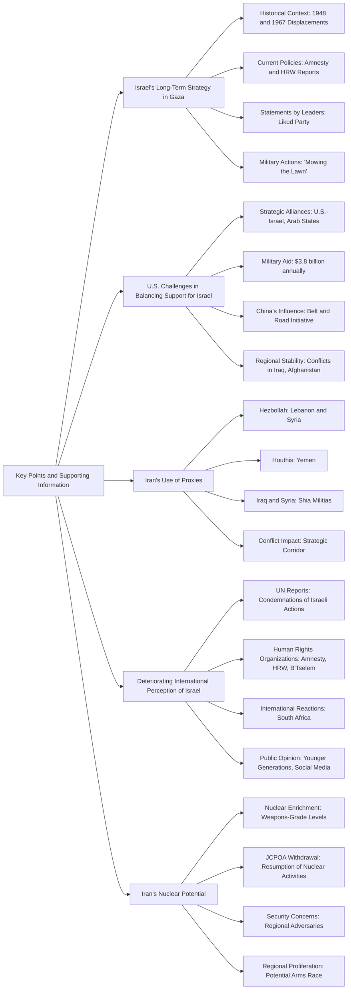

```mermaid
graph LR
    A[Key Points and Supporting Information]

    A1["Israel's Long-Term Strategy in Gaza"]
    A2["U.S. Challenges in Balancing Support for Israel"]
    A3["Iran's Use of Proxies"]
    A4["Deteriorating International Perception of Israel"]
    A5["Iran's Nuclear Potential"]

    A1a["Historical Context: 1948 and 1967 Displacements"]
    A1b["Current Policies: Amnesty and HRW Reports"]
    A1c["Statements by Leaders: Likud Party"]
    A1d["Military Actions: 'Mowing the Lawn'"]

    A2a["Strategic Alliances: U.S.-Israel, Arab States"]
    A2b["Military Aid: $3.8 billion annually"]
    A2c["China's Influence: Belt and Road Initiative"]
    A2d["Regional Stability: Conflicts in Iraq, Afghanistan"]

    A3a["Hezbollah: Lebanon and Syria"]
    A3b["Houthis: Yemen"]
    A3c["Iraq and Syria: Shia Militias"]
    A3d["Conflict Impact: Strategic Corridor"]

    A4a["UN Reports: Condemnations of Israeli Actions"]
    A4b["Human Rights Organizations: Amnesty, HRW, B'Tselem"]
    A4c["International Reactions: South Africa"]
    A4d["Public Opinion: Younger Generations, Social Media"]

    A5a["Nuclear Enrichment: Weapons-Grade Levels"]
    A5b["JCPOA Withdrawal: Resumption of Nuclear Activities"]
    A5c["Security Concerns: Regional Adversaries"]
    A5d["Regional Proliferation: Potential Arms Race"]

    A --> A1
    A --> A2
    A --> A3
    A --> A4
    A --> A5

    A1 --> A1a
    A1 --> A1b
    A1 --> A1c
    A1 --> A1d

    A2 --> A2a
    A2 --> A2b
    A2 --> A2c
    A2 --> A2d

    A3 --> A3a
    A3 --> A3b
    A3 --> A3c
    A3 --> A3d

    A4 --> A4a
    A4 --> A4b
    A4 --> A4c
    A4 --> A4d

    A5 --> A5a
    A5 --> A5b
    A5 --> A5c
    A5 --> A5d

```