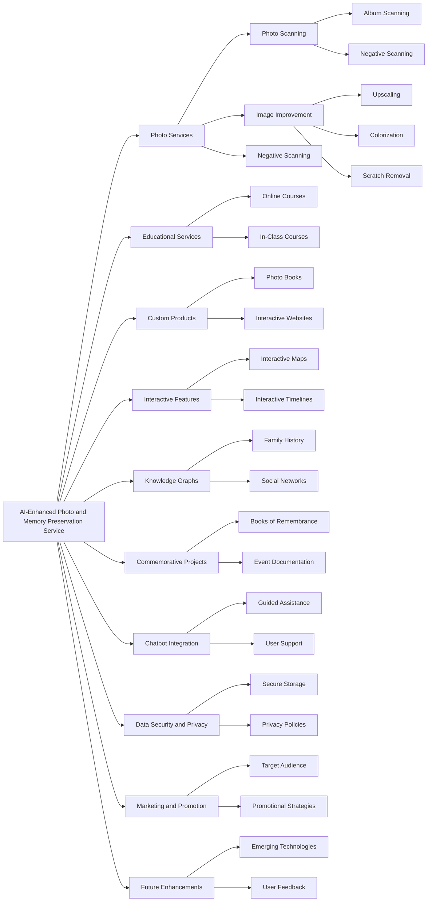

```mermaid
graph LR
    A[AI-Enhanced Photo and Memory Preservation Service]

    A --> B[Photo Services]
    A --> C[Educational Services]
    A --> D[Custom Products]
    A --> E[Interactive Features]
    A --> F[Knowledge Graphs]
    A --> G[Commemorative Projects]
    A --> H[Chatbot Integration]
    A --> I[Data Security and Privacy]
    A --> J[Marketing and Promotion]
    A --> K[Future Enhancements]

    B --> B1[Photo Scanning]
    B --> B2[Image Improvement]
    B --> B3[Negative Scanning]
    B1 --> B1A[Album Scanning]
    B1 --> B1B[Negative Scanning]
    B2 --> B2A[Upscaling]
    B2 --> B2B[Colorization]
    B2 --> B2C[Scratch Removal]

    C --> C1[Online Courses]
    C --> C2[In-Class Courses]

    D --> D1[Photo Books]
    D --> D2[Interactive Websites]

    E --> E1[Interactive Maps]
    E --> E2[Interactive Timelines]

    F --> F1[Family History]
    F --> F2[Social Networks]

    G --> G1[Books of Remembrance]
    G --> G2[Event Documentation]

    H --> H1[Guided Assistance]
    H --> H2[User Support]

    I --> I1[Secure Storage]
    I --> I2[Privacy Policies]

    J --> J1[Target Audience]
    J --> J2[Promotional Strategies]

    K --> K1[Emerging Technologies]
    K --> K2[User Feedback]
```