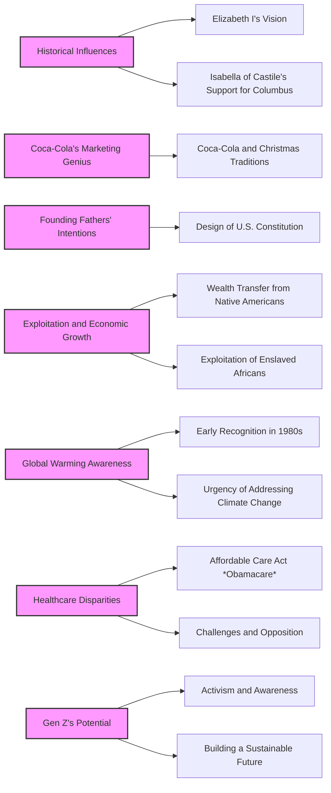

```mermaid
flowchart LR
    A[Historical Influences] --> B[Elizabeth I's Vision]
    A --> C[Isabella of Castile's Support for Columbus]
    D[Coca-Cola's Marketing Genius] --> E[Coca-Cola and Christmas Traditions]
    F[Founding Fathers' Intentions] --> G[Design of U.S. Constitution]
    H[Exploitation and Economic Growth] --> I[Wealth Transfer from Native Americans]
    H --> J[Exploitation of Enslaved Africans]
    K[Global Warming Awareness] --> L[Early Recognition in 1980s]
    K --> M[Urgency of Addressing Climate Change]
    N[Healthcare Disparities] --> O[Affordable Care Act *Obamacare*]
    N --> P[Challenges and Opposition]
    Q[Gen Z's Potential] --> R[Activism and Awareness]
    Q --> S[Building a Sustainable Future]

    style A fill:#f9f,stroke:#333,stroke-width:2px;
    style D fill:#f9f,stroke:#333,stroke-width:2px;
    style F fill:#f9f,stroke:#333,stroke-width:2px;
    style H fill:#f9f,stroke:#333,stroke-width:2px;
    style K fill:#f9f,stroke:#333,stroke-width:2px;
    style N fill:#f9f,stroke:#333,stroke-width:2px;
    style Q fill:#f9f,stroke:#333,stroke-width:2px;


```